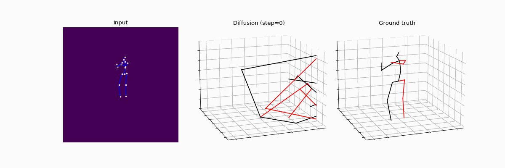

<div align="center">
<h1> DiffHPE: Robust, Coherent 3D Human Pose Lifting with Diffusion </h1>
<h3> Cédric Rommel, Eduardo Valle, Mickaël Chen, Souhaiel Khalfaoui, Renaud Marlet, Matthieu Cord, Patrick Pérez
</h3>
<h4> <i> International Conference on Computer Vision (ICCV), <br> Workshop Analysis and Modeling of Faces and Gestures, 2023 </i></h4>

 
[[arXiv](https://arxiv.org/abs/2309.01575)] [[webpage](https://valeoai.github.io/blog/publications/diffhpe.html)]

<p align="center">  </p> 
</div>

<div align="center"> <h3> Abstract </h3>  </div>
<div align="justify">

We present an innovative approach to 3D Human Pose Estimation (3D-HPE) by integrating cutting-edge diffusion models, which have revolutionized diverse fields, but are relatively unexplored in 3D-HPE. We show that diffusion models enhance the accuracy, robustness, and coherence of human pose estimations. We introduce DiffHPE, a novel strategy for harnessing diffusion models in 3D-HPE, and demonstrate its ability to refine standard supervised 3D-HPE. We also show how diffusion models lead to more robust estimations in the face of occlusions, and improve the time-coherence and the sagittal symmetry of predictions. Using the Human\,3.6M dataset, we illustrate the effectiveness of our approach and its superiority over existing models, even under adverse situations where the occlusion patterns in training do not match those in inference. Our findings indicate that while standalone diffusion models provide commendable performance, their accuracy is even better in combination with supervised models, opening exciting new avenues for 3D-HPE research.

</br>

# Getting started

## Requirements
The code requires Python 3.7 or later. The file [requirements.txt](requirements.txt) contains the full list of required Python modules.
```
pip install -r requirements.txt
```

You may also optionally install MLFlow for experiment tracking:
```
pip install mlflow
```

## Data
The [Human3.6M](http://vision.imar.ro/human3.6m/description.php) dataset was set following the [AnyGCN](https://github.com/tamasino52/Any-GCN#benchmark-setup) repository.
Please refer to it to set it up.

Consider adding the path to where the data is stored to the `data.data_dir` field in the `conf/config.yaml` file. Alternatively, this information can also be passed directly to the training/test command line if preferred, as explained below.

## Checkpoints
You can download checkpoints of pretrained models from the assets of the last code release, and put them inside `pre-trained-models` in subfolders `diff_model_ckpts` (for DiffHPE-2D and DiffHPE-Wrapper checkpoints) and `conditioners_ckpts` (for all others).

# Evaluation

Both pre-trained DiffHPE-2D and DiffHPE-Wrapper checkpoints are available in `pre-trained-models/diff_model_ckpts` folder and can be evaluated.

Just run the command below (evaluate on 27 frames input) for the DiffHPE-Wrapper for example:
```bash
python main_h36m_lifting.py run.mode=test data.data_dir=/PATH/TO/H36M/DATA/ eval.model_l=pre-trained-models/diff_model_ckpts/diffhpe-wrapper
```
Note that you can omit the `data.data_dir` part of the command if you filled the corresponding field in `conf/config.yaml` beforehand.

To evaluate DiffHPE-2D, just change the path passed to the `eval.model_l` as follows:
```bash
python main_h36m_lifting.py run.mode=test data.data_dir=/PATH/TO/H36M/DATA/ eval.model_l=pre-trained-models/diff_model_ckpts/diffhpe-2d
```

# Visualization
Given a pre-trained model checkpoint, uou can visualize the predicted poses using the script `viz.py`. For example:
```bash
python viz.py data.data_dir=/PATH/TO/H36M/DATA/ eval.model_l=pre-trained-models/diff_model_ckpts/diffhpe-wrapper viz.viz_limit=600
```
<p align="center">  </p> 

The visualization configuration can be changed within the `viz` field, in `conf/config.yaml`.

# Training

### DiffHPE-2D model
To train DiffHPE-2D from scratch, run:
```bash
python main_h36m_lifting.py data.data_dir=/PATH/TO/H36M/DATA/ +train=diffhpe-2d +diffusion=diffhpe-2d
```

### DiffHPE-Wrapper model
Likewise, you train DiffHPE-Wrapper from scratch with this command:

```bash
python main_h36m_lifting.py data.data_dir=/PATH/TO/H36M/DATA/
```

### Training with differenrt occlusions
The previous commands will train the diffusion models with standard data. If you want to train with simulated occlusions, you can choose a different data config from `conf/data`. For example, to train a DiffHPE-2D model with consecutive frames occlusion, run:
```bash
python main_h36m_lifting.py +data=lifting_cpn17_test_seq27_frame_miss data.data_dir=/PATH/TO/H36M/DATA/ +train=diffhpe-2d +diffusion=diffhpe-2d
```

Note that, in the case of DiffHPE-Wrapper, you also need to change the checkpoint of the pre-trained conditionner model to on which was trained with the same types of occlusion:
```bash
python main_h36m_lifting.py +data=lifting_cpn17_test_seq27_frame_miss data.data_dir=/PATH/TO/H36M/DATA/ diffusion.cond_ckpt=pre-trained-models/conditioners_ckpts/prt_mixste_h36m_L27_C64_structured_frame_miss.pt
```

### MixSTE baseline

This codebase can also be used to retrain the supervised MixSTE baseline (without training tricks):
```bash
python main_h36m_lifting.py data.data_dir=/PATH/TO/H36M/DATA/ +train=sup_mixste_seq27 +diffusion=sup_mixste_seq27
```

# Acknowledgments

Great part of this diffusion code was copied and modified from [A generic diffusion-based approach for 3D human pose prediction in the wild](https://github.com/vita-epfl/DePOSit), which is also heavily inspired by [CSDI](https://github.com/ermongroup/CSDI).

Human pose lifting, as well as GCN-related code was borrowed from [AnyGCN](https://github.com/tamasino52/Any-GCN#benchmark-setup), which builds on top of several other repositories, including:
- [SemGCN](https://github.com/garyzhao/SemGCN)
- [VideoPose3D](https://github.com/facebookresearch/VideoPose3D)

The baseline model MixSTE was modified from its [official paper repository](https://github.com/JinluZhang1126/MixSTE).

## Citation

```bibtex
@INPROCEEDINGS{rommel2023diffhpe,
  title={DiffHPE: Robust, Coherent 3D Human Pose Lifting with Diffusion},
  author={Rommel, C{\'e}dric and Valle, Eduardo and Chen, Micka{\"e}l and Khalfaoui, Souhaiel and Marlet, Renaud and Cord, Matthieu and P{\'e}rez, Patrick},
  booktitle={International Conference on Computer Vision Workshops (ICCVW)},
  year  = {2023}
}
```